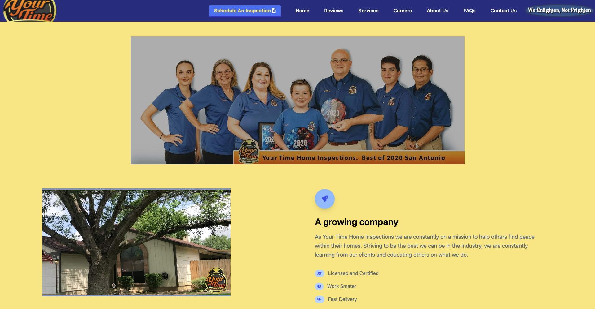
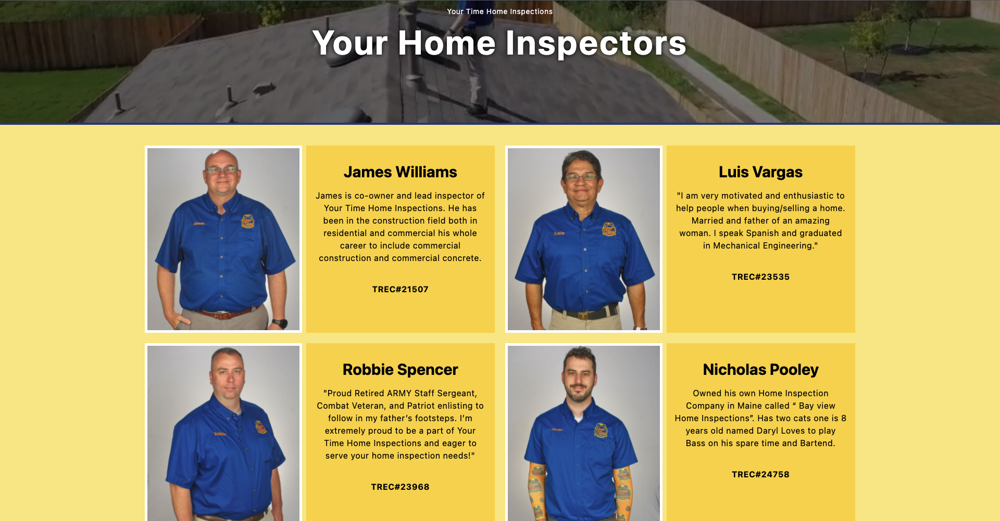

<h1>Your Time Home Inspections Website One</h1>
<h3>Framework Used:</h3>

<h3>Languages Used:</h3>

This is a website built for a home inspection comapny that gives their clients a place to reference. Clients can book inspections, learn more about the company, apply for job positions or simply look up contact information. Links to the socials are also provided on the footer where they can always be accessed.
Overall the main goal of this project is to make a fully functional website that allows clients to not only book inspections online, but to take care of comments, questions or concerns that they may have while considering getting a home inspection.
 
 

Creating cards and utilizing Tailwind's CSS framework, this allows the website to look as neat as possible as well as making it fully responsive! This makes it easier for anyone to view the website whether it be on the go or at home. Detailed desciptions of employees are provided on the "about us" page. 
 
 

<h5><i>Still a work in progress but this project has been a great opportunity for me to learn.</i><h5b>
